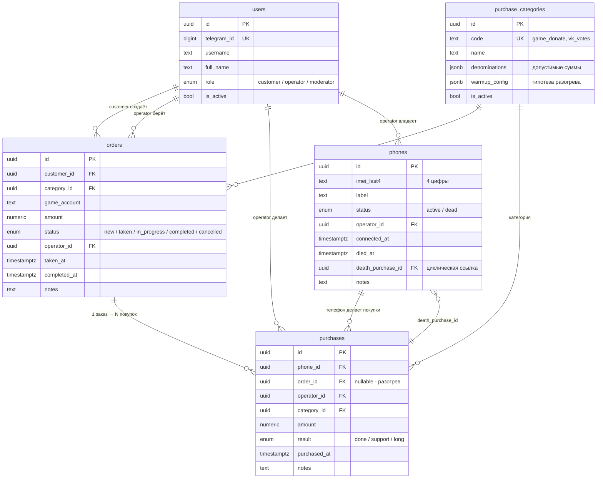

# Схема БД — donat-system

> Исходник: [`supabase/migrations/0001_init.sql`](../supabase/migrations/0001_init.sql).
> Применена в **Neon** (serverless Postgres, EU Central, бесплатный план).
> Этот документ — человекочитаемое описание для тебя и для будущих сессий Claude.

## ER-диаграмма



## Перечисления (enums)

| Enum | Значения | Где используется |
|---|---|---|
| `user_role` | `customer`, `operator`, `moderator` | `users.role` |
| `phone_status` | `active`, `dead` | `phones.status` |
| `order_status` | `new`, `taken`, `in_progress`, `completed`, `cancelled` | `orders.status` |
| `purchase_result` | `done` ✅, `support` ⚠️, `long` 💀 | `purchases.result` |

## Таблицы

### `users` — участники Telegram-бота

Все люди в системе. Идентификация — по `telegram_id`.

| Поле | Тип | Назначение |
|---|---|---|
| `id` | `uuid` PK | внутренний идентификатор |
| `telegram_id` | `bigint` UNIQUE | id из Telegram |
| `username` | `text` | TG-username (без `@`) |
| `full_name` | `text` | имя из TG |
| `role` | `user_role` | по умолчанию `customer` |
| `is_active` | `bool` | блокировка без удаления |
| `created_at`, `updated_at` | `timestamptz` | автозаполнение |

### `purchase_categories` — типы закупок

Расширяемый справочник. Логика разогрева **не в коде**, а в `warmup_config jsonb`.

| Поле | Тип | Назначение |
|---|---|---|
| `code` | `text` UNIQUE | `game_donate`, `vk_votes`, ... |
| `name` | `text` | человекочитаемое имя |
| `denominations` | `jsonb` | массив допустимых сумм, напр. `[2, 30, 100]` |
| `warmup_config` | `jsonb` | гипотеза разогрева (расписание, интервалы) |
| `is_active` | `bool` | скрыть категорию из выбора |

**Seed-данные:**
- `game_donate`: суммы `[2, 30, 100]`, расписание разогрева на 5 дней
- `vk_votes`: суммы `[4]` (и мелкие)

**⚠️ Правило разогрева (для аналитики):**
- `game_donate` **$2 — всегда разогрев телефона**, не заказ (заказов на $2 не бывает).
- `game_donate` **$30 / $100 — реальные закупки** (боевая нагрузка).
- `vk_votes` — **всегда заказы** (включая мелкие), не разогрев.
- Различать по `category` + `amount`; отдельное поле в БД не нужно.

### `phones` — рабочие телефоны

Идентифицируются по 4 цифрам IMEI. Умершие телефоны остаются в БД для истории.

| Поле | Тип | Назначение |
|---|---|---|
| `imei_last4` | `text` CHECK regex `^\d{4}$` | 4 цифры IMEI |
| `label` | `text` | человекочитаемая метка, напр. "iPhone 13 синий" |
| `status` | `phone_status` | `active` или `dead` |
| `operator_id` | `uuid` → `users.id` | за кем телефон |
| `connected_at` | `timestamptz` | когда подключён в строй |
| `died_at` | `timestamptz` | когда умер (NULL пока жив) |
| `death_purchase_id` | `uuid` → `purchases.id` | какая покупка убила |
| `notes` | `text` | заметки оператора |

**Бизнес-правила:**
- ≤3 активных одновременно — триггер `enforce_max_active_phones`
- IMEI уникален только среди активных — частичный unique index `phones_active_imei_unique`
- При получении 💀 `long` телефон автоматически переходит в `dead` (триггер `handle_long_result`)

### `orders` — заказы заказчиков

Один заказ = одна цель (игр.аккаунт + сумма). Может породить несколько фактических покупок (повторы после ⚠️ `support`, переносы на новый телефон после 💀 `long`).

| Поле | Тип | Назначение |
|---|---|---|
| `customer_id` | `uuid` → `users.id` | кто заказал |
| `category_id` | `uuid` → `purchase_categories.id` | тип закупки |
| `game_account` | `text` | игровой аккаунт |
| `amount` | `numeric(12,2)` CHECK > 0 | сумма заказа |
| `status` | `order_status` | жизненный цикл |
| `operator_id` | `uuid` → `users.id` | NULL пока не взят |
| `taken_at`, `completed_at` | `timestamptz` | вехи |

### `purchases` — фактические покупки (ядро базы знаний)

Каждая покупка — это точное время, телефон, сумма, результат. Главная таблица для аналитики разогрева.

| Поле | Тип | Назначение |
|---|---|---|
| `phone_id` | `uuid` → `phones.id` | с какого телефона |
| `order_id` | `uuid` → `orders.id` **nullable** | NULL — это разогревочная покупка |
| `operator_id` | `uuid` → `users.id` | кто покупал |
| `category_id` | `uuid` → `purchase_categories.id` | тип закупки |
| `amount` | `numeric(12,2)` CHECK > 0 | сумма $ (реально потрачено через Apple Pay) |
| `result` | `purchase_result` | ✅ `done` / ⚠️ `support` / 💀 `long` |
| `game` | `text` nullable | игра (напр. «Массив»), опционально — миграция `0002` |
| `purchased_at` | `timestamptz` | **точное время покупки** (главное для аналитики) |
| `notes` | `text` | заметки оператора |

**Индексы:**
- `(phone_id, purchased_at)` — таймлайн по телефону
- `(order_id)` — все покупки заказа
- `(result)` — фильтр по статусу
- `(category_id)` — фильтр по типу

## Бизнес-правила в БД (триггеры)

### `enforce_max_active_phones`
Перед `INSERT/UPDATE` в `phones`: если новый статус `active` и уже есть 3 других активных — `RAISE EXCEPTION`.

### `handle_long_result`
После `INSERT` в `purchases`: если `result = 'long'` — переводим телефон в `dead`, фиксируем `died_at = purchased_at` и `death_purchase_id = new.id`.

### `set_updated_at` (на всех таблицах)
Перед `UPDATE`: `updated_at = now()`.

## RLS (Row Level Security)

**RLS включён на всех 5 таблицах.** Политик пока нет.

- **Бот** ходит в БД через `service_role` — RLS обходится автоматически, политики не нужны.
- **Веб-аналитика** будет использовать `anon`/`authenticated` — для них добавим политики на этапе фронта (например: модератор видит всё, оператор — свои заказы, заказчик — только свои).

## Полезные запросы (примеры)

### Все покупки конкретного телефона по времени
```sql
select purchased_at, amount, result, notes
  from purchases
 where phone_id = $1
 order by purchased_at;
```

### Сколько ⚠️/💀 у каждой категории по суммам
```sql
select c.code, p.amount, p.result, count(*)
  from purchases p
  join purchase_categories c on c.id = p.category_id
 group by c.code, p.amount, p.result
 order by c.code, p.amount;
```

### Средний «возраст» телефона до 💀 long
```sql
select avg(died_at - connected_at) as avg_lifespan
  from phones
 where status = 'dead';
```

### Последняя покупка убила телефон
```sql
select ph.imei_last4, ph.label, p.purchased_at, p.amount, p.notes
  from phones ph
  join purchases p on p.id = ph.death_purchase_id
 where ph.status = 'dead'
 order by ph.died_at desc;
```

## Будущие изменения схемы

См. [`TODO.md`](../TODO.md). Все структурные изменения схемы — через новые файлы миграций
(`supabase/migrations/0002_xxx.sql` и далее), применяемые вручную в Neon SQL Editor.
**Никогда не редактируем уже применённую миграцию.**

## Подключение к БД

| Тип | Когда использовать |
|---|---|
| `DATABASE_URL` (pooler) | Бот, Next.js — основное подключение приложения |
| `DATABASE_URL_DIRECT` (direct) | Drizzle-миграции, DDL-операции |

Connection strings хранятся в `.env` (локально, не в git). Шаблон — `.env.example`.
