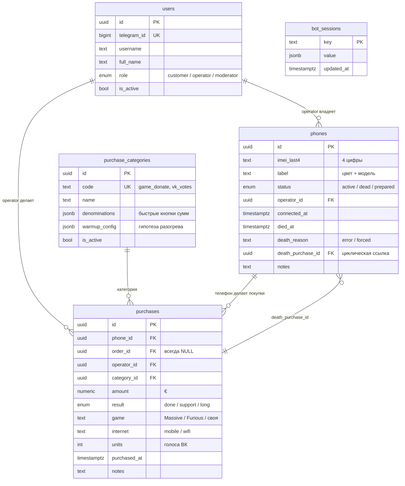

# Схема БД — donat-system

> Исходники: [`supabase/migrations/`](../supabase/migrations/) — файлы `0001`…`0007`.
> Применены в **Neon** (serverless Postgres, EU Central, бесплатный план) **вручную**
> через Neon SQL Editor. Claude DDL не применяет.
> Зеркало схемы в коде — [`bot/src/db/schema.ts`](../bot/src/db/schema.ts) (только типы и запросы).

## Миграции

| Файл | Что добавил |
|---|---|
| `0001_init.sql` | начальная схема: `users`, `purchase_categories`, `phones`, `orders`, `purchases`, триггеры, RLS |
| `0002_add_purchase_game.sql` | `purchases.game` — игра (Massive / Furious / своя) |
| `0003_bot_sessions.sql` | `bot_sessions` — хранилище grammy-сессий (нужно для serverless) |
| `0004_phone_death_reason.sql` | `phones.death_reason` — `'error'` / `'forced'` |
| `0005_purchase_internet.sql` | `purchases.internet` — `'mobile'` / `'wifi'` |
| `0006_purchase_units.sql` | `purchases.units` — количество единиц (для ВК — голоса) |
| `0007_phone_prepared.sql` | значение `prepared` в enum `phone_status` |

**Никогда не редактируем уже применённую миграцию** — только новый файл `000N_*.sql`.

## ER-диаграмма



> Таблица **`orders` существует, но не используется** — наследие модели «доска заказов»,
> от которой отказались. `purchases.order_id` всегда `NULL`. Не удаляем (не мешает),
> но и не заполняем.

## Перечисления (enums)

| Enum | Значения | Где |
|---|---|---|
| `user_role` | `customer`, `operator`, `moderator` | `users.role` |
| `phone_status` | `active`, `dead`, `prepared` | `phones.status` (`prepared` — резерв, не в лимите ≤3; миграция `0007`) |
| `purchase_result` | `done` ✅, `support` ⚠️, `long` 💀 | `purchases.result` |
| `order_status` | `new`, `taken`, … | `orders.status` (не используется) |

## Таблицы

### `users` — участники бота

| Поле | Тип | Назначение |
|---|---|---|
| `telegram_id` | `bigint` UNIQUE | id из Telegram — единственная идентификация |
| `username`, `full_name` | `text` | из профиля TG |
| `role` | `user_role` | по умолчанию `customer` = без доступа |
| `is_active` | `bool` | блокировка без удаления |

### `purchase_categories` — типы закупок

| Поле | Тип | Назначение |
|---|---|---|
| `code` | `text` UNIQUE | `game_donate`, `vk_votes` |
| `denominations` | `jsonb` | быстрые кнопки: `[30, 100]` (игры) или `[{units,price}]` (ВК) |
| `warmup_config` | `jsonb` | гипотеза разогрева — **правится без миграций** |

**Текущие значения:**
- `game_donate`: `[30, 100]`. Кнопка **€2 добавляется в коде только для игры Massive**
  (разогрев ведём исключительно через неё). Остальное — «✏️ Другая сумма» текстом.
- `vk_votes`: `[{10,0.99},{18,1.99},{28,2.99},{40,3.99}]` — голоса · €.

Правка методик: `npx tsx src/db/set-warmup.ts` (тексты в коде утилиты).

### `phones` — рабочие телефоны

| Поле | Тип | Назначение |
|---|---|---|
| `imei_last4` | `text` CHECK `^\d{4}$` | 4 цифры IMEI |
| `label` | `text` | метка вида «Чёрный 16 про» — **модель важна для аналитики** |
| `status` | `phone_status` | `active` / `dead` / `prepared` |
| `connected_at` | `timestamptz` | когда введён в работу (для `prepared` — момент перевода) |
| `died_at` | `timestamptz` | когда умер |
| `death_reason` | `text` | `'error'` (ошибка Apple = достиг предела) / `'forced'` (вывод бюджета) |
| `death_purchase_id` | `uuid` → `purchases.id` | какая покупка убила (для post-mortem) |

**Бизнес-правила (триггеры):**
- ≤3 активных одновременно — `enforce_max_active_phones` (`prepared` не в лимите)
- IMEI уникален только среди активных — частичный unique index `phones_active_imei_unique`
- 💀 `long` → статус `dead`, `died_at`, `death_purchase_id`, `death_reason='error'` — `handle_long_result`

> ⚠️ **`forced` исключать из расчёта порогов** — это искусственные смерти (возврат бюджета,
> блокировка), они не отражают предел телефона.

### `purchases` — ядро базы знаний

Каждая строка — одна транзакция Apple Pay. Главная таблица для поиска коридора.

| Поле | Тип | Назначение |
|---|---|---|
| `phone_id` | `uuid` → `phones.id` | с какого телефона |
| `order_id` | `uuid` nullable | **всегда NULL** (заказов в боте нет) |
| `operator_id` | `uuid` → `users.id` | кто вбил |
| `category_id` | `uuid` → `purchase_categories.id` | 🎮 танки / 🗳 ВК |
| `amount` | `numeric(12,2)` CHECK > 0 | **сумма в €** |
| `result` | `purchase_result` | ✅ `done` / ⚠️ `support` / 💀 `long` |
| `game` | `text` nullable | Massive / Furious / своя (миграция `0002`) |
| `internet` | `text` nullable | `'mobile'` / `'wifi'` (миграция `0005`) |
| `units` | `integer` nullable | голоса ВК (миграция `0006`) |
| `purchased_at` | `timestamptz` | **время записи = время покупки** — вбивать сразу! |
| `notes` | `text` | заметка оператора |

**Индексы:** `(phone_id, purchased_at)`, `(order_id)`, `(result)`, `(category_id)`.

> ⚠️ **Тонкости для аналитики:**
> 1. Строка 💀 `long` — это **попытка**, а не оплата: её `amount` телефон по факту не потратил
>    (waiver-окно всплыло вместо списания). При подсчёте «€ извлечено» вычитать её.
> 2. Строки ВК-мультизакупа получают **одинаковое** `purchased_at` — при анализе интервалов
>    считать серию одним событием.

### `bot_sessions` — состояние пошагового ввода

Хранилище grammy-сессий. Нужно, потому что Vercel serverless не держит память между
запросами. `key` — идентификатор чата, `value` — JSON состояния мастер-формы.

## RLS (Row Level Security)

**RLS включён на всех таблицах, политик нет.** Бот подключается к Neon **напрямую по
`DATABASE_URL`** с полными правами владельца — RLS его не ограничивает. Политики
понадобятся, если появится веб-фронт с публичным доступом (этап `web/`).

## Полезные запросы

### Что телефон реально извлёк (минус убившая попытка)
```sql
select ph.imei_last4, ph.label, ph.status, ph.death_reason,
       count(p.id) as txns,
       sum(p.amount) - coalesce(
         (select p2.amount from purchases p2 where p2.id = ph.death_purchase_id
          and ph.death_reason = 'error'), 0) as eur_real,
       extract(epoch from (coalesce(ph.died_at, now()) - min(p.purchased_at)))/86400 as days
  from phones ph join purchases p on p.phone_id = ph.id
 group by ph.id
 order by eur_real desc;
```

### Темп закупок и судьба (главная закономерность)
```sql
select ph.imei_last4,
       round(count(p.id) / greatest(extract(epoch from
         (coalesce(ph.died_at, now()) - min(p.purchased_at)))/86400, 0.5), 2) as per_day,
       sum(p.amount) as eur, ph.death_reason
  from phones ph join purchases p on p.phone_id = ph.id
 group by ph.id order by per_day;
```

### Смертность по типу интернета (только танки)
```sql
select p.internet, p.result, count(*)
  from purchases p join purchase_categories c on c.id = p.category_id
 where c.code = 'game_donate' and p.amount = 100
 group by p.internet, p.result;
```

### ВК: голосов в день по телефону
```sql
select ph.imei_last4, (p.purchased_at at time zone 'Europe/Moscow')::date as d,
       count(*) as txns, sum(p.units) as votes
  from purchases p join phones ph on ph.id = p.phone_id
  join purchase_categories c on c.id = p.category_id
 where c.code = 'vk_votes'
 group by ph.imei_last4, d order by d;
```

## Подключение

| Переменная | Когда использовать |
|---|---|
| `DATABASE_URL` (pooler) | бот и все запросы приложения |
| `DATABASE_URL_DIRECT` (direct) | DDL-операции, если понадобятся |

Строки подключения — в локальном `.env` (не в git) и в env-переменных Vercel.
Шаблон — `.env.example`.

> ⚠️ Neon free — **scale-to-zero**: БД засыпает через ~5 минут простоя, просыпается 1–2 с.
> В SQL Editor первый `Run` после сна может дать «Failed to connect» — просто повторить.
