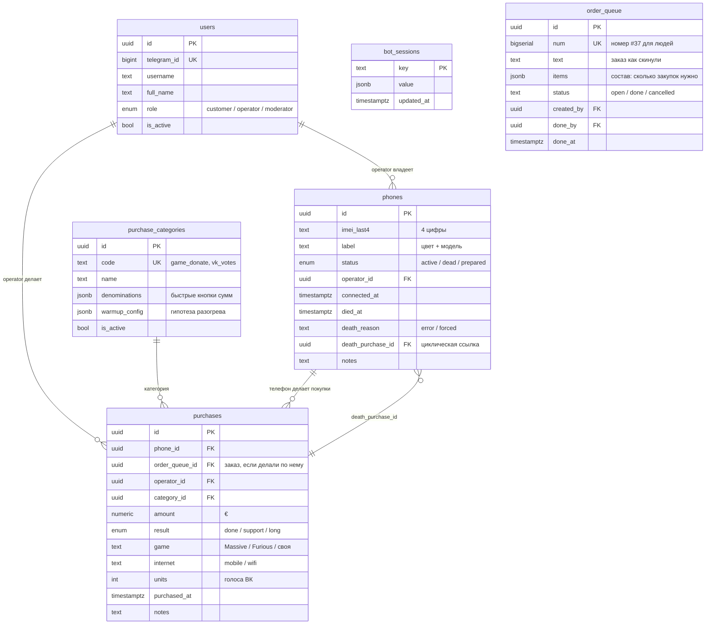

# Схема БД — donat-system

> Исходники: [`supabase/migrations/`](../supabase/migrations/) — файлы `0001`…`0012`.
> Применены в **Neon** (serverless Postgres, EU Central, бесплатный план) **вручную**
> через Neon SQL Editor. Claude DDL не применяет.
> Зеркало схемы в коде — [`bot/src/db/schema.ts`](../bot/src/db/schema.ts) (только типы и запросы).

## Миграции

| Файл | Что добавил |
|---|---|
| `0001_init.sql` | начальная схема: `users`, `purchase_categories`, `phones`, `orders`, `purchases`, триггеры, RLS |
| `0002_add_purchase_game.sql` | `purchases.game` — игра (Massive / Furious / своя) |
| `0003_bot_sessions.sql` | `bot_sessions` — хранилище grammy-сессий (нужно для serverless) |
| `0004_phone_death_reason.sql` | `phones.death_reason` — `'error'` / `'forced'` |
| `0005_purchase_internet.sql` | `purchases.internet` — `'mobile'` / `'wifi'` |
| `0006_vk_units.sql` | `purchases.units` — количество единиц (для ВК — голоса) |
| `0007_phone_prepared.sql` | значение `prepared` в enum `phone_status` |
| `0008_order_queue.sql` | `order_queue` — простой список заказов команды |
| `0009_purchase_order_link.sql` | `purchases.order_queue_id` — связь покупки с заказом |
| `0010_order_items.sql` | `order_queue.items` — состав заказа (сколько закупок нужно) |
| `0011_drop_legacy_orders.sql` | **удалены** таблица `orders`, `purchases.order_id`, enum `order_status` |
| `0012_bot_sessions_rls.sql` | RLS на `bot_sessions` (забыли в `0003`) — применена 12.09 |

**Никогда не редактируем уже применённую миграцию** — только новый файл `000N_*.sql`.

## ER-диаграмма



> Рабочих таблиц ровно **шесть**. Старая `orders` (наследие модели «доска заказов»,
> от которой отказались) и колонка `purchases.order_id` **удалены** миграцией `0011`
> — они стояли пустыми, а две «заказные» колонки на `purchases` сбивали с толку.
> Заказы живут в `order_queue`, связь с покупкой — `purchases.order_queue_id`.

## Перечисления (enums)

| Enum | Значения | Где |
|---|---|---|
| `user_role` | `customer`, `operator`, `moderator` | `users.role` |
| `phone_status` | `active`, `dead`, `prepared` | `phones.status` (`prepared` — резерв, не в лимите ≤3; миграция `0007`) |
| `purchase_result` | `done` ✅, `support` ⚠️, `long` 💀 | `purchases.result` |

> Enum `order_status` удалён вместе с таблицей `orders` (миграция `0011`).
> У `order_queue.status` тип обычный `text` — отдельный enum ему не нужен.

## Таблицы

### `users` — участники бота

| Поле | Тип | Назначение |
|---|---|---|
| `telegram_id` | `bigint` UNIQUE | id из Telegram — единственная идентификация |
| `username`, `full_name` | `text` | из профиля TG |
| `role` | `user_role` | по умолчанию `customer` = без доступа |
| `is_active` | `bool` | блокировка без удаления |

### `purchase_categories` — типы закупок

| Поле | Тип | Назначение |
|---|---|---|
| `code` | `text` UNIQUE | `game_donate`, `vk_votes` |
| `denominations` | `jsonb` | быстрые кнопки: `[30, 100]` (игры) или `[{units,price}]` (ВК) |
| `warmup_config` | `jsonb` | гипотеза разогрева — **правится без миграций** |

**Текущие значения:**
- `game_donate`: `[30, 100]`. Кнопка **€2 добавляется в коде только для игры Massive**
  (разогрев ведём исключительно через неё). Остальное — «✏️ Другая сумма» текстом.
- `vk_votes`: `[{10,0.99},{18,1.99},{28,2.99},{40,3.99}]` — голоса · €.

Правка методик: `npx tsx src/db/set-warmup.ts` (тексты в коде утилиты).

### `phones` — рабочие телефоны

| Поле | Тип | Назначение |
|---|---|---|
| `imei_last4` | `text` CHECK `^\d{4}$` | 4 цифры IMEI |
| `label` | `text` | метка вида «Чёрный 16 про» — **модель важна для аналитики** |
| `status` | `phone_status` | `active` / `dead` / `prepared` |
| `connected_at` | `timestamptz` | когда введён в работу (для `prepared` — момент перевода) |
| `died_at` | `timestamptz` | когда умер |
| `death_reason` | `text` | `'error'` (ошибка Apple = достиг предела) / `'forced'` (вывод бюджета) |
| `death_purchase_id` | `uuid` → `purchases.id` | какая покупка убила (для post-mortem) |

**Бизнес-правила (триггеры):**
- ≤3 активных одновременно — `enforce_max_active_phones` (`prepared` не в лимите)
- IMEI уникален только среди активных — частичный unique index `phones_active_imei_unique`
- 💀 `long` → статус `dead`, `died_at`, `death_purchase_id`, `death_reason='error'` — `handle_long_result`

> ⚠️ **`forced` исключать из расчёта порогов** — это искусственные смерти (возврат бюджета,
> блокировка), они не отражают предел телефона.

### `purchases` — ядро базы знаний

Каждая строка — одна транзакция Apple Pay. Главная таблица для поиска коридора.

| Поле | Тип | Назначение |
|---|---|---|
| `phone_id` | `uuid` → `phones.id` | с какого телефона |
| `order_queue_id` | `uuid` nullable → `order_queue.id` | заказ, по которому сделана (миграция `0009`); NULL у разогрева и ВК |
| `operator_id` | `uuid` → `users.id` | кто вбил |
| `category_id` | `uuid` → `purchase_categories.id` | 🎮 танки / 🗳 ВК |
| `amount` | `numeric(12,2)` CHECK > 0 | **сумма в €** |
| `result` | `purchase_result` | ✅ `done` / ⚠️ `support` / 💀 `long` |
| `game` | `text` nullable | Massive / Furious / своя (миграция `0002`) |
| `internet` | `text` nullable | `'mobile'` / `'wifi'` (миграция `0005`) |
| `units` | `integer` nullable | голоса ВК (миграция `0006`) |
| `purchased_at` | `timestamptz` | **время записи = время покупки** — вбивать сразу! |
| `notes` | `text` | заметка оператора |

**Индексы:** `(phone_id, purchased_at)`, `(result)`, `(category_id)`.
Индекс по `order_id` удалён вместе с колонкой (миграция `0011`).

> ⚠️ **Тонкости для аналитики:**
> 1. Строка 💀 `long` — это **попытка**, а не оплата: её `amount` телефон по факту не потратил
>    (waiver-окно всплыло вместо списания). При подсчёте «€ извлечено» вычитать её.
> 2. Строки ВК-мультизакупа получают **одинаковое** `purchased_at` — при анализе интервалов
>    считать серию одним событием.

### `order_queue` — список заказов команды (миграция `0008`)

Внутренний список задач для двух операторов: скинул текст заказа → отметил
выполненным или отменённым. Это НЕ доска заказчиков — от неё отказались
осознанно (см. анти-цели в `TODO.md`).

| Поле | Тип | Назначение |
|---|---|---|
| `num` | `bigserial` UNIQUE | человеческий номер — «Заказ #37» |
| `text` | `text` | заказ как скинули, свободный текст |
| `items` | `jsonb` | состав заказа (миграция `0010`), NULL = ещё не подтверждён |
| `status` | `text` CHECK | `open` / `done` / `cancelled` |
| `created_by` | `uuid` → `users.id` | кто добавил |
| `done_by` / `done_at` | `uuid` / `timestamptz` | кто и когда закрыл |

**Состав заказа** (`items`, миграция `0010`) — сколько закупок требует заказ:

```json
{ "total": 2, "list": [ {"label":"орден","amount":30,"game":"Furious"},
                        {"label":"прем год","amount":105,"game":"Furious"} ] }
```

Бот распознаёт состав из текста (`bot/src/handlers/order-parse.ts`), оператор
подтверждает кнопкой. Заказ закрывается, только когда успешных закупок ≥ `total`.
Если состав задавали вручную числом, `list` пуст, а `total` заполнен.
⚠️ `bigserial` не откатывается — в нумерации заказов бывают пропуски, это нормально.

**Связь с покупками** (миграция `0009`): `purchases.order_queue_id` → `order_queue.id`,
nullable. Заполняется, когда закупку делают через «📥 Заказы → ✅ Выполнить».
Покупки без заказа (разогрев €2, ВК) остаются с NULL — их большинство.

> ⚠️ На аналитику «зелёного коридора» связь не влияет: в её запросах эта колонка
> не участвует. Опасение было про лишний шаг в флоу закупки — его нет, потому что
> идём от заказа и контекст уже известен.

Новый заказ автоматически постится в группу с тегами операторов/модераторов
(в группе `@упоминание` даёт персональный пинг, в канале — нет).

### `bot_sessions` — состояние пошагового ввода

Хранилище grammy-сессий. Нужно, потому что Vercel serverless не держит память между
запросами. `key` — идентификатор чата, `value` — JSON состояния мастер-формы.

## RLS (Row Level Security)

**Состояние на 12.09.2026:** RLS включён на **всех шести** рабочих таблицах,
**политик нет ни у одной**. На `bot_sessions` его забыли в миграции `0003` —
аудит это нашёл, исправлено миграцией `0012` (применена, данные не затронуты,
запись и чтение сессий проверены после включения).

⚠️ **Сегодня RLS не защищает ничего, и это нормально.** Бот подключается к Neon
напрямую по `DATABASE_URL` как `neondb_owner`, у которого `rolbypassrls = true` —
он обходит RLS в любом случае. Других ролей в базе нет, снаружи никто не
подключается. Данные защищает **секретность `DATABASE_URL`**, а не RLS.

Смысл RLS появится на этапе веб-фронта (`web/`): там заведём отдельную роль
без `bypassrls` и напишем политики. Вот тогда таблица, забытая без RLS, стала бы
единственной открытой — поэтому несогласованность чиним заранее, а не потом.

## Полезные запросы

### Что телефон реально извлёк (минус убившая попытка)
```sql
select ph.imei_last4, ph.label, ph.status, ph.death_reason,
       count(p.id) as txns,
       sum(p.amount) - coalesce(
         (select p2.amount from purchases p2 where p2.id = ph.death_purchase_id
          and ph.death_reason = 'error'), 0) as eur_real,
       extract(epoch from (coalesce(ph.died_at, now()) - min(p.purchased_at)))/86400 as days
  from phones ph join purchases p on p.phone_id = ph.id
 group by ph.id
 order by eur_real desc;
```

### Темп закупок и судьба (главная закономерность)
```sql
select ph.imei_last4,
       round(count(p.id) / greatest(extract(epoch from
         (coalesce(ph.died_at, now()) - min(p.purchased_at)))/86400, 0.5), 2) as per_day,
       sum(p.amount) as eur, ph.death_reason
  from phones ph join purchases p on p.phone_id = ph.id
 group by ph.id order by per_day;
```

### Смертность по типу интернета (только танки)
```sql
select p.internet, p.result, count(*)
  from purchases p join purchase_categories c on c.id = p.category_id
 where c.code = 'game_donate' and p.amount = 100
 group by p.internet, p.result;
```

### ВК: голосов в день по телефону
```sql
select ph.imei_last4, (p.purchased_at at time zone 'Europe/Moscow')::date as d,
       count(*) as txns, sum(p.units) as votes
  from purchases p join phones ph on ph.id = p.phone_id
  join purchase_categories c on c.id = p.category_id
 where c.code = 'vk_votes'
 group by ph.imei_last4, d order by d;
```

## Бэкап и восстановление

**Ежедневно в 12:05 МСК** (`api/cron-export.ts`, Vercel Cron) в группу «Pattern_analyst 🧮»
падают два файла — история чата и есть наш архив:

| Файл | Что внутри | Зачем |
|---|---|---|
| `backup-full-ГГГГ-ММ-ДД.json` | сырые строки `users`, `purchase_categories`, `phones`, `purchases`, `order_queue` | **полное восстановление** базы один в один |
| `purchases-ГГГГ-ММ-ДД.csv` | покупки в плоском виде | удобно открыть в Excel |

> ⚠️ **Почему JSON, а не только CSV.** В CSV телефон записан лишь 4 цифрами IMEI —
> они повторяются у разных аппаратов, и в нём НЕТ метки телефона (модели),
> `death_reason` (error/forced), дат жизни и `warmup_config`. Без этого анализ
> «зелёного коридора» после восстановления не собрать. JSON содержит `phone_id` —
> точную привязку покупок к аппаратам.

`bot_sessions` не бэкапим — это временное состояние ввода, ценности нет.

> ⚠️ **Дампы, снятые ДО 12.09.2026**, содержат у `purchases` лишнюю колонку
> `order_id` — наследие таблицы `orders`, удалённой миграцией `0011`. Во всех
> строках там `NULL`, данных в ней нет: при восстановлении старого дампа эту
> колонку нужно просто отбросить, иначе вставка упадёт на несуществующем поле.

### Как восстановить из JSON

1. Создать пустую базу и применить миграции `0001`…`0012` по порядку.
2. Взять последний `backup-full-*.json` из группы.
3. Вставить строки **в порядке ключа `meta.tables`** — он учитывает зависимости
   внешних ключей: `users` → `purchase_categories` → `phones` → `purchases` → `order_queue`.
4. Отдельно: у `phones.death_purchase_id` ссылка на `purchases` — заполнять её
   вторым проходом (`update phones set death_purchase_id = …`), после вставки покупок.
5. Сбросить счётчик номеров заказов:
   `select setval('order_queue_num_seq', (select coalesce(max(num), 1) from order_queue));`

> 💡 У Neon есть и своё восстановление на момент времени, но на бесплатном плане
> глубина хранения небольшая и настраивается в панели. На него полагаться нельзя:
> если проблема с аккаунтом, а не с базой, оно тоже будет недоступно. Бэкап в Telegram
> от Neon не зависит — это главная страховка.

## Подключение

| Переменная | Когда использовать |
|---|---|
| `DATABASE_URL` (pooler) | бот и все запросы приложения |
| `DATABASE_URL_DIRECT` (direct) | DDL-операции, если понадобятся |

Строки подключения — в локальном `.env` (не в git) и в env-переменных Vercel.
Шаблон — `.env.example`.

> ⚠️ Neon free — **scale-to-zero**: БД засыпает через ~5 минут простоя, просыпается 1–2 с.
> В SQL Editor первый `Run` после сна может дать «Failed to connect» — просто повторить.
